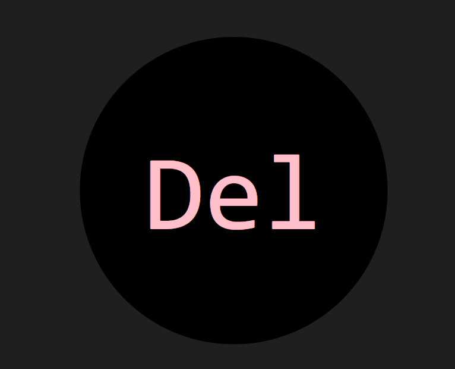
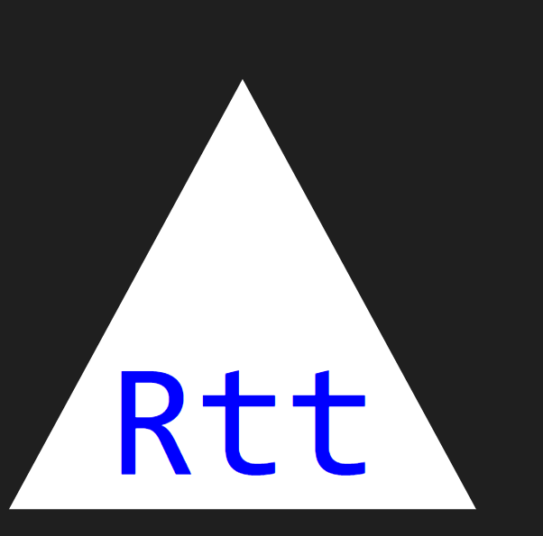
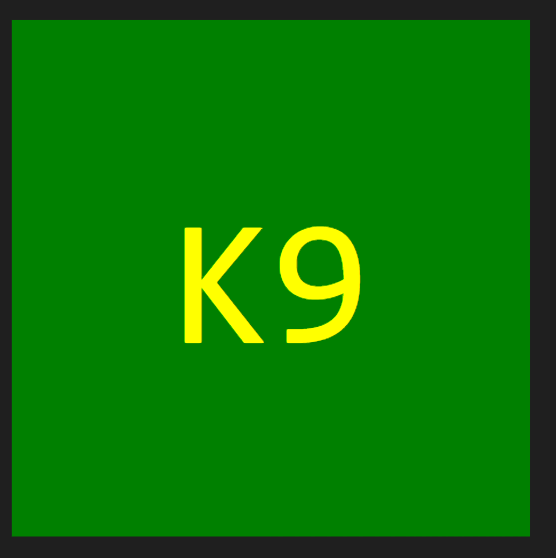

# Angelin_SVGLogoMaker

## Purpose
The purpose of this application is to generate logos for squares, circles, or triangles, each accompanied by a 3-letter character. Users can easily customize the text and logo background colors to suit their preferences. By utilizing this application, the aim is to save costs on hiring a Graphic Designer for logo creation.

## Live Demo & Screenshots of readme -
This application is not deployed as a live website. It is a tool to be used locally.    
**Link to live demo:**    
[DemoLogoMaker](examples/Angelin_SVGLogoMakerDemo.webm)
_May need to download the mp4 video to enable audio from the assets folder. Also, Attached is a link incase the demo mp4 does not work_
https://clipchamp.com/watch/pkIldH5VSbD

**Screenshots:** 

## Functionality of the website-
After installing the application locally, you can run it using the command node index.js. This will present you with a series of prompts that you need to answer. The application will then populate your responses to generate a logo which is generated in the Logo.svg file. The following prompts are presented to the user:
* Text for your Logo? (Enter up to three characters)
* Text color?
* Select a Logo Shape from options below:
* Color for your Logo?

The prompt for the logo shape provides users with choices to select from. After all 4 prompts are answered, a Logo.svg file is generated that contains the Logo created based on user input.

## Creation steps-
Created a new repository within Github (included README file)
Copied the ssh url for cloning
Performed a git clone command followed by the copied ssh url in my local (VS code)
Inquirer was installed using the npm i inquirer command in the terminal
Jest was installed as a devDependency so tests can be run
Validated that node_modules files are under .gitignore
Multiple commits and git push was done to keep repository up to date
Progress was checked multiple times by running node index.js in the terminal
Final commit and push was performed to add codes to github

## Outside source reference:
1. Screen Recording: https://app.screencastify.com/
2. Read about Super: https://developer.mozilla.org/en-US/docs/Web/JavaScript/Reference/Operators/super
3. Learned about Throw: https://developer.mozilla.org/en-US/docs/Web/JavaScript/Reference/Statements/throw
4. Read more into Inquirer: https://www.npmjs.com/package/inquirer
5. Read more into Prompt: https://www.npmjs.com/package/prompt
6. Tutoring and study session